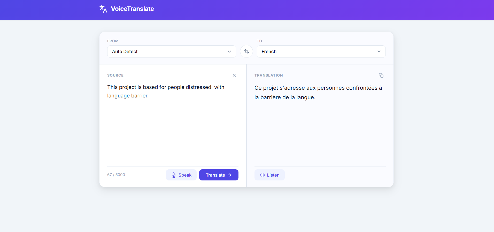

# VoiceTranslate

A web-based voice and text translator supporting 70+ languages, built with Python (Flask) and powered by Google Translate and Google Text-to-Speech APIs.

---

## Visuals



---

## Features

- **Speech input** — click Speak, talk into your mic, and the app auto-translates
- **Text input** — type anything and hit Translate (or `Ctrl+Enter`)
- **Audio playback** — listen to the translated output via gTTS
- **70+ languages** — covers major languages of every region worldwide
- **Copy translation** — one-click copy to clipboard
- **Swap languages** — instantly flip source and target language
- **Auto-detect** — detect the source language automatically

---

## Project Structure

```
Translator/
├── app.py                  # Flask backend + /translate API
├── requirements.txt        # Python dependencies
├── .gitignore
├── templates/
│   └── index.html          # Main UI template
├── static/
│   ├── styles.css          # Stylesheet
│   ├── app.js              # Frontend logic (speech, fetch, UI)
│   └── audio/              # Generated TTS audio files (auto-created)
├── strans.py               # Standalone CLI version (Windows only)
├── voice_creator.py        # Script to generate voice prompt .mp3 files
└── gtts_token.py           # Unofficial fix for gTTS tokenizer bug
```

---

## Requirements

- Python 3.8+
- A working microphone (for speech input)
- Internet connection (Google Translate and gTTS are online APIs)
- Windows / macOS / Linux

---

## Setup & Installation

### 1. Clone the repository

```bash
git clone <your-repo-url>
cd Translator
```

### 2. (Recommended) Create a virtual environment

```bash
python -m venv venv

# Windows
venv\Scripts\activate

# macOS / Linux
source venv/bin/activate
```

### 3. Install dependencies

```bash
pip install -r requirements.txt
```

### 4. Fix the gTTS tokenizer (required)

There is a known bug in the `gtts` library's tokenizer. Replace the library file with the fixed version included in this repo:

```bash
# Find the gtts_token file location
python -c "import gtts; import os; print(os.path.dirname(gtts.__file__))"
```

Copy `gtts_token.py` from this repo into the `gtts_token/` subfolder inside the path printed above, replacing the existing file.

---

## Running the App

```bash
python app.py
```

Then open your browser at:

```
http://127.0.0.1:5000
```

---

## How to Use

| Action | How |
|---|---|
| Translate typed text | Type in the left panel → click **Translate** |
| Translate with voice | Click **Speak** → talk → auto-translates |
| Listen to translation | Click **Listen** after translating |
| Copy translation | Click the copy icon (top-right of output panel) |
| Swap languages | Click the ⇄ button between the dropdowns |
| Stop speaking | Click **Stop** |

Keyboard shortcut: **Ctrl + Enter** to trigger translation.

---

## Supported Language Regions

| Region | Example Languages |
|---|---|
| Global | English, Spanish, French, Arabic, Chinese, Russian, Portuguese, German |
| South Asia | Hindi, Bengali, Urdu, Tamil, Telugu, Marathi, Gujarati, Kannada, Malayalam, Nepali |
| East & SE Asia | Japanese, Korean, Vietnamese, Thai, Indonesian, Malay, Filipino, Burmese, Khmer |
| Europe | Italian, Dutch, Polish, Swedish, Greek, Czech, Hungarian, Romanian, Ukrainian, + more |
| Middle East & Central Asia | Persian, Turkish, Hebrew, Azerbaijani, Armenian, Georgian, Kazakh, Uzbek |
| Africa | Swahili, Amharic, Hausa, Yoruba, Zulu, Afrikaans, Somali, Kinyarwanda |
| Americas | Haitian Creole |
| Pacific | Maori, Samoan, Hawaiian |

All languages supported by Google Translate are compatible.


---

## Core Libraries

| Library | Purpose |
|---|---|
| `flask` | Web server and routing |
| `googletrans` | Text detection and translation |
| `gTTS` | Text-to-speech audio generation |
| `SpeechRecognition` | Microphone input (CLI version) |
| `requests` | HTTP calls |
